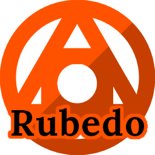

#
Rubedo is a game engine based on [Monogame](https://monogame.net/), with the goal of being extremely easy to work in while remaining completely open source. (That is, you'll never have to pay anyone to use any part of this!)
It tries to be very Unity-like in structure, although deviates severely for several systems because I hate how Unity does certain things.
Even though, if you've used Unity before, a good chunk of this should make sense.

 **[Documentation](docs/README.md)**

 # What does it do?
Stuff. IDK I need to write this section. It doesn't use the Content Pipeline, that's for sure.

 # How do I do?
 I really need to make a standard way of setting up the project. This currently is very annoying. I will make a Visual Studio template in the future for easy installation.
 For now, though, What's important is that your csproj file has this:
 ```csproj
  <Target Name="BuildContent" AfterTargets="PostBuildEvent">
    <Exec Command="Rubedo.Compiler.exe $(ProjectDir) $(TargetDir) textures" WorkingDirectory="$(ProjectDir)\ContentBuilder" />
  </Target>
  
  <PropertyGroup>
    <DisableFastUpToDateCheck>true</DisableFastUpToDateCheck>
  </PropertyGroup>
```
This allows the content compiler to run whenever you build the game, which it needs to so it can make sure all content is properly compiled.
This does mean you'll need to build the [Rubedo Compiler](https://github.com/Sirplop/Rubedo.Compiler). Visit that to see how. Note that this will be automated in the future.

# Can I use this?
If you want. It's MIT liscenced, and no library it uses have a restrictive liscence, either.

# Library Attribution
[Monogame](https://monogame.net/)

[FontStashSharp](https://github.com/Sirplop/FontStashSharp)

[NLog](https://nlog-project.org/)

[SoLoud](https://github.com/jarikomppa/soloud)
## The compiler uses these
[SkiaSharp](https://github.com/mono/SkiaSharp)

[AsepriteDotNet](https://github.com/AristurtleDev/AsepriteDotNet)